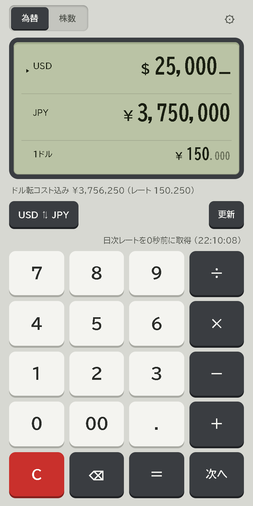
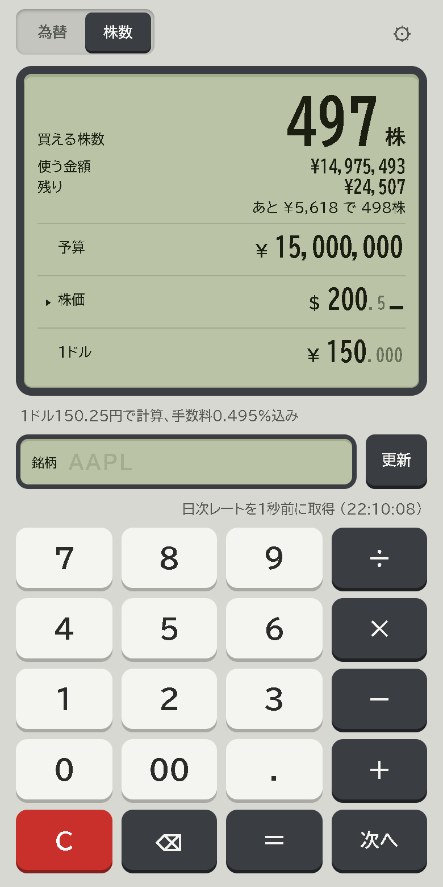

# fx-share-calc

[日本語](README.md) | English

An ad-free USD/JPY converter and share calculator for Japanese investors buying US stocks. It runs in the browser and installs to an Android home screen like a native app. The interface is in Japanese.

**Live app: https://taka-s-dev.github.io/fx-share-calc/**

  
  &nbsp;
  

## Features

- Converts USD and JPY in either direction, and shows the yen cost including the broker's FX spread
- Calculates how many shares a yen budget buys, after spread and trading fees, plus how much more is needed for one more share
- Refreshes the rate every 60 seconds while the app is open, and flags sudden moves such as those around jobs reports or currency interventions
- On-screen keypad that accepts arithmetic in every field, e.g. a budget of `2,000,000 − 150,000`
- Long-press a number on the display to copy it for pasting into a broker app
- Works offline with the last fetched rate

## Install on Android

1. Open the live app in Chrome.
2. Choose "Add to Home screen" from the menu.

## Rate sources

| Setup | Source | Update interval |
| --- | --- | --- |
| No API key (default) | [ExchangeRate-API open access](https://www.exchangerate-api.com/docs/free) | Once a day |
| Twelve Data API key | [Twelve Data](https://twelvedata.com/) | Every 60 seconds, plus live stock prices by ticker |

A Twelve Data key is free to obtain. Enter it in the settings screen (⚙). The key is stored only in the browser's local storage on that device and is sent only to Twelve Data.

To stay within the free tier (8 credits a minute, 800 a day), the app fetches only while it is open, and open tabs share a single fetch per minute. If the limit is hit anyway, fetching pauses until it resets.

Default fee settings (0.25 JPY spread, 0.495% commission capped at $22) are typical values; adjust them in settings to match your broker.

## How it is built

- A single `index.html` with plain HTML, CSS and JavaScript, with no framework and no build step
- A service worker (`sw.js`) caches the app and fonts for offline use and updates the installed app automatically
- Deployed with GitHub Pages from the `main` branch

To run it locally, serve the folder over HTTP, for example `python -m http.server`, and open `http://localhost:8000`.

## License

[MIT](LICENSE)
